<div align="center">


# Recurse

**Learn it. Keep it.**

A spaced-repetition learning app. Short lessons, active recall and an FSRS review schedule,<br />
across programming, computer science, math, science, history and languages.

[](https://github.com/H4ch1Net/Recurse/actions/workflows/ci.yml)


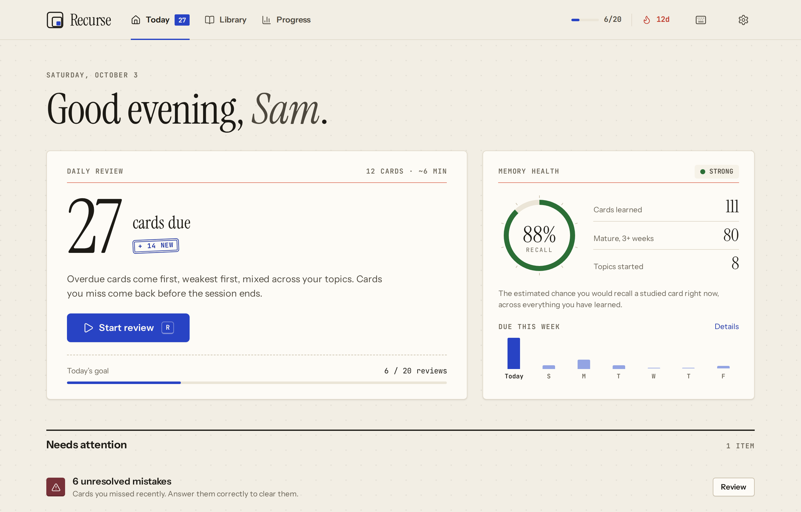

</div>

## What it is

Most people forget about half of what they read within a day or two. Rereading and highlighting feel
productive but barely slow that down. Two things reliably do: **retrieving** an answer from memory,
and **spacing** those retrievals out over time.

Recurse is built around those two ideas. Each topic is a short lesson followed by a bank of questions.
After you answer a card, the [FSRS](https://github.com/open-spaced-repetition/fsrs4anki/wiki/The-Algorithm)
scheduler estimates how quickly you will forget it and brings it back right before that happens.
Cards you know well drift weeks and months apart. Cards you miss come back the same session.

It runs entirely in the browser. There is no account, no server and no tracking. Progress is stored in
`localStorage` and can be exported as a backup at any time.

## Features

| | |
|---|---|
| **37 built-in topics, 632 cards** | Nine subjects, each topic with an 11 to 15 minute lesson, key terms, a summary and 17 or 18 questions with explanations. |
| **Lessons that test you** | Every lesson section ends with a check question. Key terms have a "hide definitions" self-quiz mode. |
| **Five question types** | Multiple choice, fill the blank, find the bug, type the answer (auto-checked, accent and number aware) and open recall (self-graded). |
| **Real scheduling** | FSRS via `ts-fsrs`. Overdue cards first, weakest first. New cards follow the lesson order. Configurable target retention. |
| **Retry before you leave** | Missed cards are requeued a few cards later, up to twice, so every session ends on a correct recall. |
| **Daily review** | One button mixes due cards from every topic (interleaving) and adds a capped number of new ones. |
| **Mistake journal** | Every miss is logged with your answer. Review them as a session; a correct answer clears the entry. |
| **Explain it (Feynman)** | Write a plain-language explanation. Key terms light up as you use them. Compare with the lesson summary, or get written feedback from an AI model with your own key. |
| **Your own packs** | Build decks in the app, paste a list exported from Quizlet or Anki, import JSON from a URL or file, or generate a pack on any topic with AI. |
| **Progress** | Review forecast, a year of activity, memory by topic, accuracy by question type, achievements, session history and a shareable image. |
| **Built for daily use** | Light and dark themes, keyboard shortcuts for everything, a mobile layout with a tab bar, installable PWA that works offline. |

<details>
<summary><b>All topics by subject</b></summary>

| Subject | Topics |
|---|---|
| Programming | Python Basics, Variables and Types, Loops and Functions, Object-Oriented Programming, JavaScript Basics, TypeScript Basics, SQL Basics |
| Computer Science | Data Structures, Algorithms, Complexity & Big-O, Operating Systems, System Design 101 |
| Developer Tools | Git Basics, Linux Command Line, Docker Basics, Regular Expressions |
| Web | How the Web Works, HTML & CSS |
| Networks & Security | Networking Basics, Cybersecurity 101, Cryptography Basics |
| Mathematics | Algebra Essentials, Probability & Statistics, Logic & Discrete Math, Calculus Foundations, Linear Algebra Basics |
| Science | Physics: Mechanics, Chemistry Basics, Biology: Cells & Genetics, Earth & Space Science |
| Humanities | World Geography, Modern World History, Economics Basics, How Learning Works |
| Languages | Spanish Essentials, French Essentials, Japanese: Hiragana |

</details>

## Screenshots

<table>
  <tr>
    <td width="50%">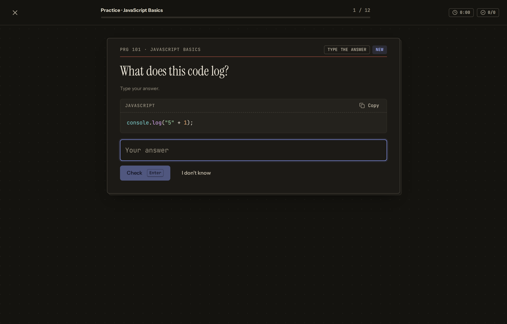<br /><sub>Study session, dark theme</sub></td>
    <td width="50%">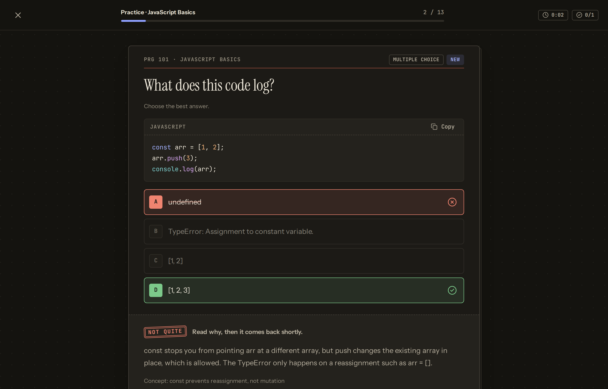<br /><sub>Feedback with explanation and lesson excerpt</sub></td>
  </tr>
  <tr>
    <td>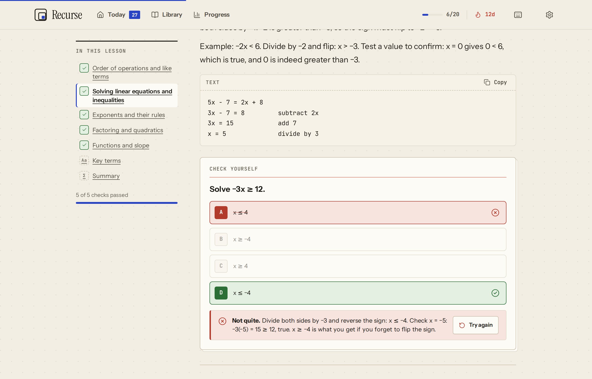<br /><sub>Lesson with section checks</sub></td>
    <td>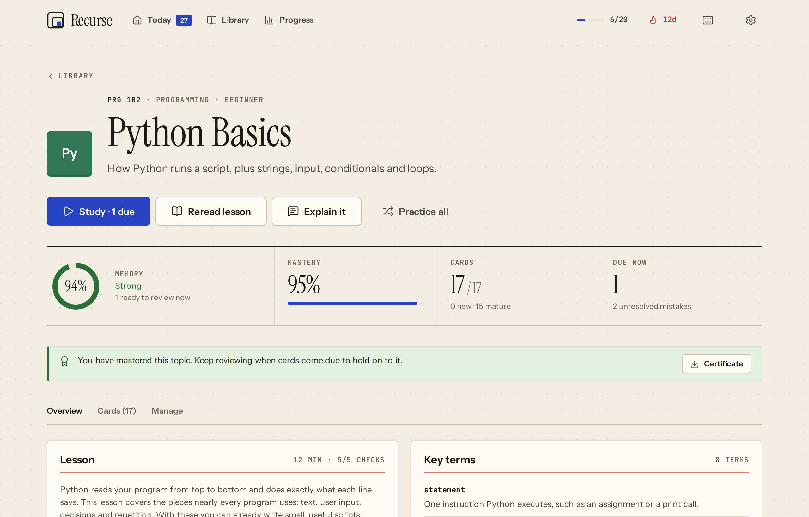<br /><sub>Topic overview</sub></td>
  </tr>
  <tr>
    <td>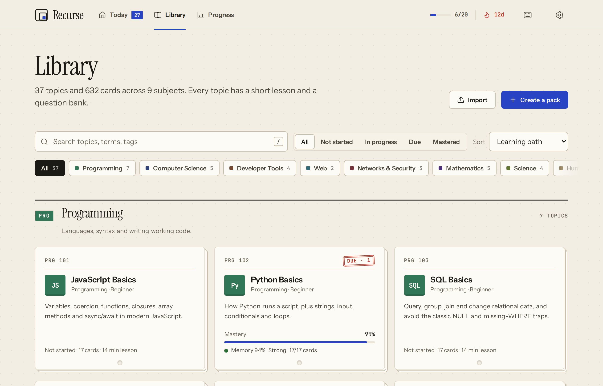<br /><sub>Library</sub></td>
    <td>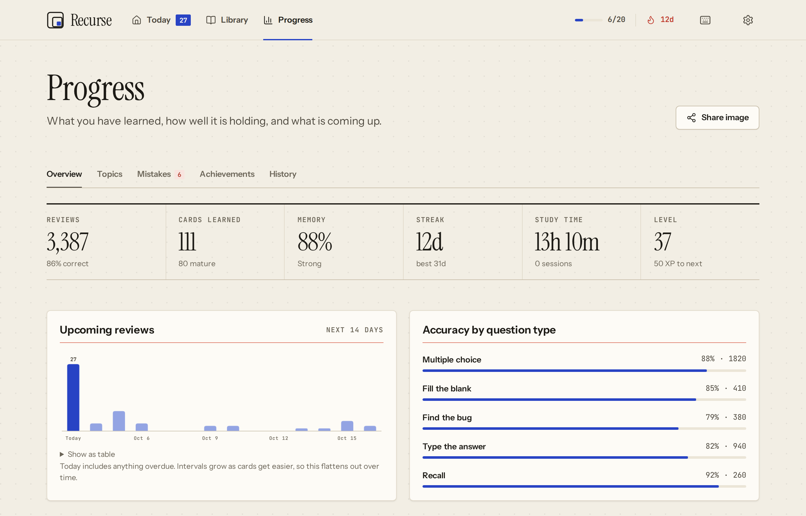<br /><sub>Progress</sub></td>
  </tr>
  <tr>
    <td>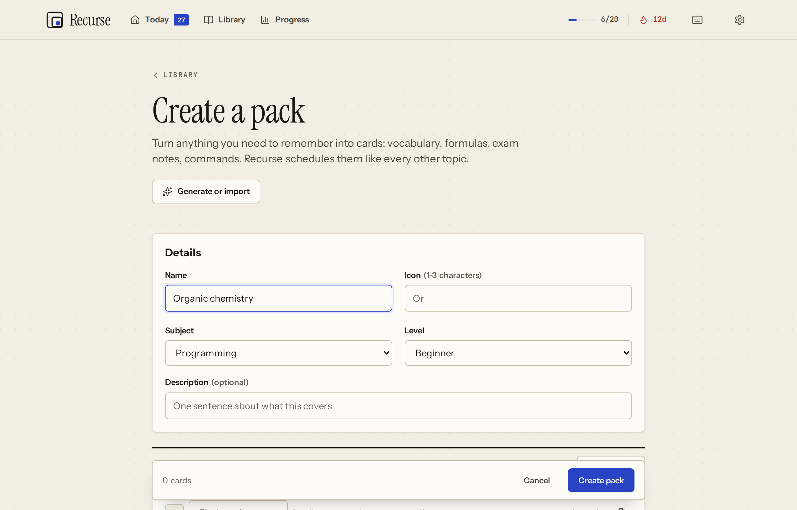<br /><sub>Pack builder</sub></td>
    <td>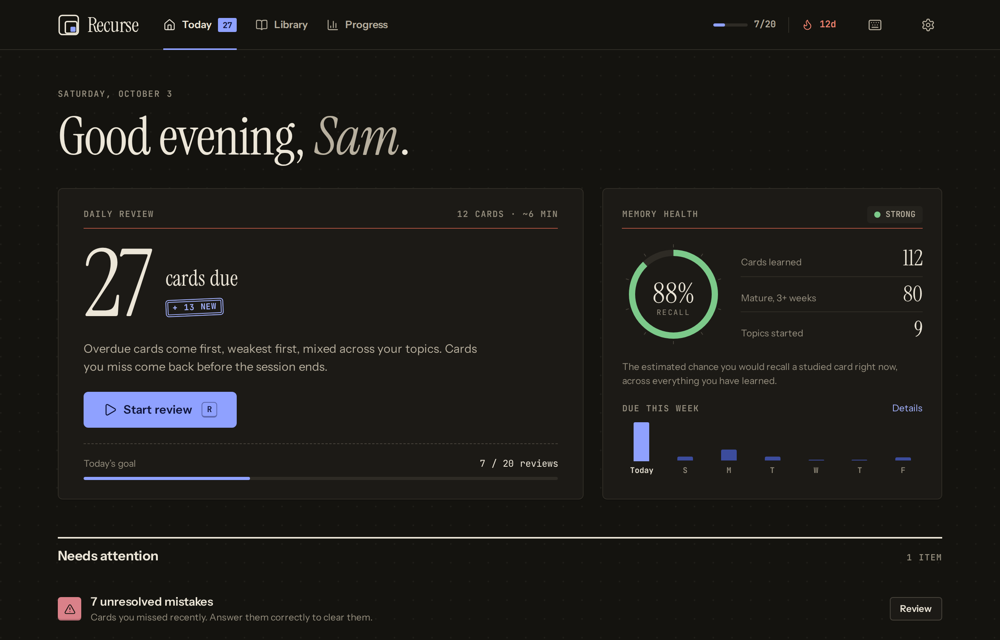<br /><sub>Today, dark theme</sub></td>
  </tr>
</table>

<p align="center">
  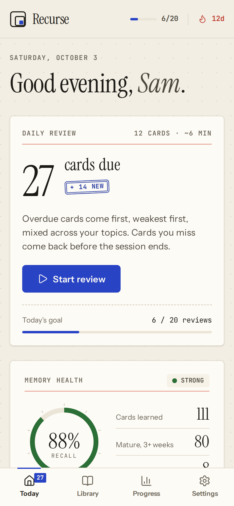
  &nbsp;&nbsp;
  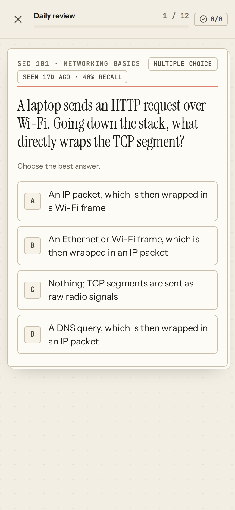
</p>

## Design

The interface borrows from library card catalogs and Swiss typography. Each topic is an index card:
a call number (`PRG 102`) and a red heading rule at the top, a punched rod hole at the bottom and a few
cards stacked behind it. Due counts and session results are rubber stamps. Explanations are written on
ruled paper, and the session summary is a checkout slip.

| Element | Choice |
| --- | --- |
| Display | Instrument Serif, for titles and numerals |
| Interface | Instrument Sans |
| Labels, call numbers, code | JetBrains Mono, ligatures off |
| Color | Warm paper and ink, one cobalt accent, stamp red for status. Subject colors act as catalog tab colors |
| Motion | 120 to 360 ms on one easing curve. Cards are dealt in, stamps press, bars fill. Off under `prefers-reduced-motion` |

Tokens are defined once in `src/styles/app.css`, with a dark theme block. The illustrations in
`src/components/Illustration.jsx` are inline SVG drawn with the same tokens, so they follow the theme.
Text colors meet WCAG AA in both themes. The share image and certificate are drawn on a canvas in
`src/lib/share.js` in the same style.

## How a card moves through Recurse

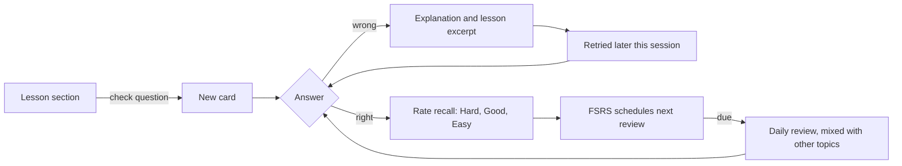

- A wrong answer is always graded **Again**. Rating buttons only appear when you got it right (or for
  open recall cards, where you judge yourself), and each one shows when the card will come back.
- **Memory** is the model's estimate of the chance you would recall a card right now. It decays
  continuously between reviews.
- **Mastery** averages how stable each card's memory is, counting unstudied cards as zero. A card counts
  as fully learned at three weeks of stability. A topic shows as mastered at 90% mastery with strong memory.

## Getting started

Requires Node.js 20.19 or newer.

```bash
git clone https://github.com/H4ch1Net/Recurse.git
cd Recurse/Recurse
npm install
npm run dev
```

Open http://localhost:5173. The first visit walks through a short setup and suggests a first topic.

### Commands

Run from the `Recurse/` directory.

| Command | What it does |
|---|---|
| `npm run dev` | Development server with hot reload |
| `npm run build` | Production build to `dist/` |
| `npm run preview` | Serve the production build locally |
| `npm test` | Unit tests (Vitest) |
| `npm run lint` | ESLint |
| `npm run validate:packs` | Check every built-in pack against the strict schema |
| `npm run check` | Lint, validate packs, test and build in one go (what CI runs) |
| `npm run screenshots` | Rebuild `docs/screenshots/` from the production build with demo data. Needs Playwright Chromium |
| `npm run icons` | Regenerate the PNG app icons in `public/` |

### Keyboard shortcuts

| Where | Keys |
|---|---|
| Anywhere | <kbd>T</kbd> Today, <kbd>L</kbd> Library, <kbd>S</kbd> Progress, <kbd>,</kbd> Settings, <kbd>?</kbd> list all shortcuts |
| Today and Library | <kbd>R</kbd> start daily review, <kbd>/</kbd> search |
| Studying | <kbd>A</kbd>-<kbd>D</kbd> choose, <kbd>Enter</kbd> submit or continue, <kbd>1</kbd>-<kbd>4</kbd> rate, <kbd>E</kbd> lesson excerpt, <kbd>Z</kbd> undo, <kbd>Esc</kbd> leave |

## Configuration

Everything is set in the app under **Settings** and stored locally.

| Setting | Default | Notes |
|---|---|---|
| Daily goal | 20 reviews | Shown in the header and on Today |
| New cards per day | 15 | Limits new cards in the daily review. Studying a topic directly is not limited |
| Session length | 12 cards | Missed cards are retried on top of this |
| Target retention | 90% | Higher means shorter intervals and more reviews |
| Focus timer | Off | Optional countdown during sessions with a break reminder |
| Theme | System | Light, dark or follow the device |

### Optional AI features

Written Feynman feedback and pack generation need an API key from one of these providers. The key stays
in the browser and requests go directly from your browser to the provider. Everything else works without it.

| Provider | Default model | Key |
|---|---|---|
| Anthropic | `claude-haiku-4-5` | [console.anthropic.com](https://console.anthropic.com/settings/keys) |
| OpenAI | `gpt-4o-mini` | [platform.openai.com](https://platform.openai.com/api-keys) |
| OpenRouter | `google/gemma-3-4b-it:free` | [openrouter.ai](https://openrouter.ai/keys) |

Any model the provider offers can be entered in Settings. Use **Test connection** to check the key.

## Adding content

Built-in topics are JSON files in `Recurse/src/data/packs/`. A new file there shows up in the library
with no code changes. The format, question types and writing guidelines are in
[`Recurse/docs/packs.md`](Recurse/docs/packs.md). Run `npm run validate:packs` before committing.

Packs made in the app, or shared as JSON, use the same format with looser rules: a name and some
questions are enough.

## Project structure

```
Recurse/
├── index.html
├── public/                 PWA manifest, service worker, icons
├── scripts/                pack validator, screenshot and icon generators
├── docs/                   pack format guide, README screenshots
└── src/
    ├── data/packs/         built-in topics (one JSON file per topic)
    ├── lib/                framework-free logic, unit tested
    │   ├── memory.js       FSRS wrapper: scheduling, retrievability, previews
    │   ├── session.js      builds study queues (due, new, practice, mistakes)
    │   ├── answers.js      typed answer matching
    │   ├── progress.js     mastery, topic summaries, review forecast
    │   ├── packSchema.js   pack validation and sanitizing (shared with the CLI)
    │   ├── storage.js      localStorage, v1 migration, backups
    │   └── ai.js           optional provider calls
    ├── state/              app state provider and actions
    ├── components/         layout, code blocks, charts, dialogs, illustrations
    ├── pages/              one file per screen
    └── styles/             design tokens and component styles
```

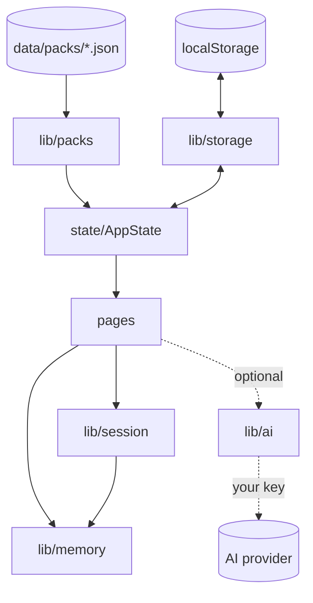

State has one owner: `AppProvider` holds progress, stats, settings and user packs, and every change goes
through an action that also persists it and unlocks achievements. The `lib/` modules do not import React,
so they are tested directly.

## Data and privacy

- All data lives in this browser's `localStorage`. Clearing site data removes it.
- **Settings > Back up** downloads everything as JSON (without your API key). **Restore** accepts backups
  from this version and from v1.
- Data saved by v1 of the app is migrated automatically on first load: stats, streak, XP, achievements,
  lesson status and settings carry over. The v1 question bank was replaced, so card schedules start fresh.
- With the app open in two tabs, each tab picks up the other's changes instead of overwriting them.
- No analytics and no third-party requests. Fonts are bundled. The only outbound calls are the AI
  requests you trigger with your own key.

## Deployment

The app is a static site. Build with `npm run build` and serve `Recurse/dist/` from any static host.
Every route must fall back to `index.html`; `Recurse/vercel.json` does this for Vercel (set the project
root directory to `Recurse`). After a deploy, open pages pick up the new version on the next navigation
because the service worker fetches HTML from the network first.

## Troubleshooting

<details>
<summary>The app looks out of date after an update</summary>

Reload once. If it persists, open the browser's developer tools, unregister the service worker for the
site and reload. HTML is always fetched fresh when online, so this should only happen offline.
</details>

<details>
<summary>"Progress could not be saved"</summary>

The browser refused to write to `localStorage`. This happens in some private browsing modes or when site
storage is full or disabled. Download a backup from Settings, then allow storage for the site.
</details>

<details>
<summary>AI requests fail</summary>

Use **Settings > Test connection**. A rejected key, a model name the provider does not offer, or an
account without credit are the usual causes. The error message from the provider is shown.
</details>

<details>
<summary><code>npm run screenshots</code> cannot find a browser</summary>

Install Chromium for Playwright once with `npx playwright install chromium`, then build and run it again.
</details>

## Contributing

Issues and pull requests are welcome, especially new topics and corrections to existing ones.

1. Fork and create a branch.
2. For content, follow [`docs/packs.md`](Recurse/docs/packs.md) and check facts carefully.
3. Run `npm run check` in `Recurse/`.
4. Open a pull request describing what changed and why.

See [`ROADMAP.md`](Recurse/ROADMAP.md) for planned work.

## License

[MIT](LICENSE)
